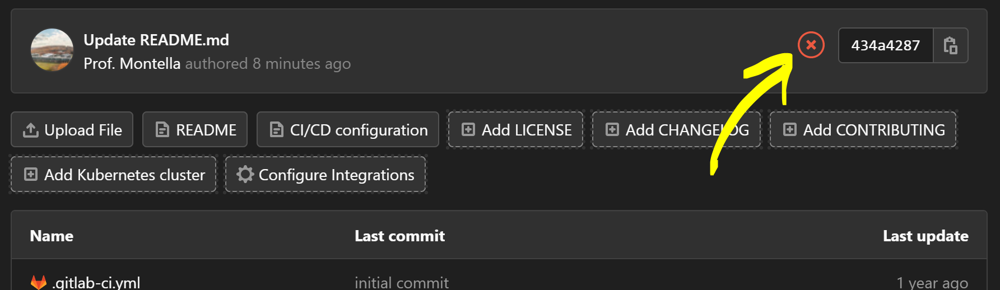

# Lehigh University CSE109 - Systems Software - Homework 1

**Due Date**: 7/9/2021 EOD

## Instructions

The purpose of this assignment is to familiarize yourself with the homework submission process. Every homework, quiz, and exam will be hosted in a repository located at:

```
https://gitlab.com/lehigh-cse-109/summer-2021/assignments/<assignment-name>
```

Homeworks, quizzes, and exams may require you to write code that passes a number of tests to get full credit. For information on the testing framework refer to the documentation [here](https://docs.gitlab.com/ee/ci/).

The process of accepting and submitting on assignments will proceed as follows:

1. Fork the relevant repository into your CSE109 project namespace. [Instructions](https://docs.gitlab.com/ee/workflow/forking_workflow.html#creating-a-fork)

2. Clone your newly forked repository to your computer. Your repository should be hosted at 
```
https://gitlab.com/<your lehigh e-mail id>-cse109/<assignment name>
```
It is very important your projects are hosted at this specific address, as the tools I've writted to adminitrate this course assume this address. If you fork an assignment into the wrong namespace, you can easily move it. [Instructions](https://docs.gitlab.com/ee/user/project/settings/#transferring-an-existing-project-into-another-namespace) 


You can use the following git command with the appropriate values substituted to customize it for your :
```
git clone https://gitlab.com/<your lehigh e-mail id>-cse109/<assignment name>
```
[Instructions](https://docs.gitlab.com/ee/gitlab-basics/start-using-git.html#clone-a-repository) 

3. The red circle with an x in it indicates that a job failed to run.



Jobs are automatic scripts that execute under given conditions e.g. every time code is committed, or on a schedule like once per day. A list of completed jobs for this repository can be found [here](https://gitlab.com/lehigh-cse-109/summer-2021/assignments/homework-1/-/jobs). 

You can discover why any job failed by clicking on it. You'll see the console output of the job script. Follow [this link](https://gitlab.com/lehigh-cse-109/summer-2021/assignments/homework-1/-/jobs/1403201380#L29) for one example. This will give you an idea as how to what you need to do to fix the code. Modify `main.c` so that it compiles. 

The important part is here:

```shell
$ gcc main.c
main.c: In function 'main':
main.c:4:24: error: expected ';' before 'return'
    4 |   printf("Hello World")
      |                        ^
      |                        ;
    5 |   return 0;
      |   ~~~~~~  
```

4. Commit the changes you made locally to your gitlab repository. Follow the instructions [here](https://githowto.com/staging_and_committing) (read sections 6, 7 and 8) about staging and committing changes.

5. When you commit the patched code, a new job will be scheduled to run. It will enter a queue, and will run when the a server has availability. Usually this happens instantaneously, but sometimes you may have to wait. Eventually, the following script is executed:

```yml
image: "gcc:11.1.0"

test:gcc:
  script:
  - gcc --version
  - gcc main.c
```

This script loads a [docker container](https://hub.docker.com/_/gcc/) configured with gcc version 11.1.0, prints out the version of gcc, and then tries to compile `main.c`. If you've fixed the mistake, the job should successfully complete and the red X will be replaced with a green check.

If you've gotten the green check, there's nothing more you need to do; because the code is version controlled, it's already available to the graders.
